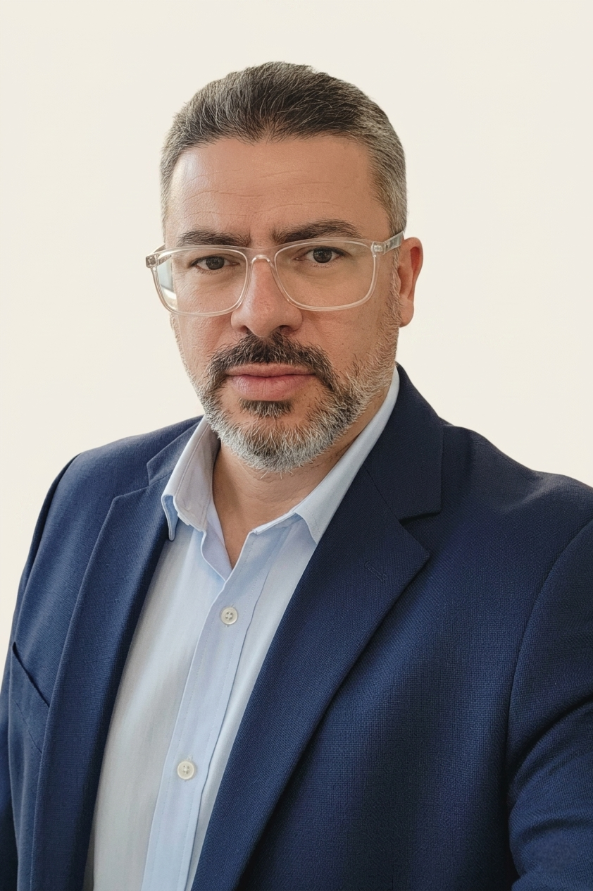
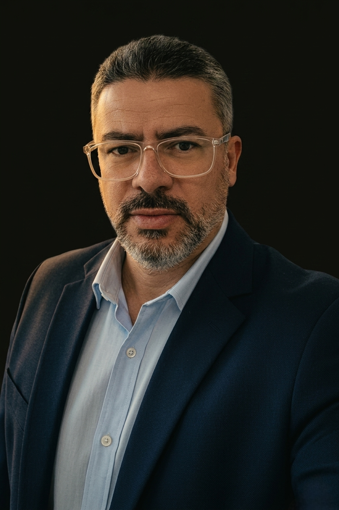

# Copy de Vendas — O Guardião Sóbrio
### Páginas de captura (lead magnets) + página de vendas (ebook) + sequência de email

---

## 1. PÁGINA DE CAPTURA — Lead Magnet Familiar
**"O Escudo da Família"**

---

**[HEADLINE]**
Você não pode salvar alguém que não quer ser salvo.
Mas pode parar de se destruir tentando.

**[SUBHEADLINE]**
Um guia prático para cônjuges e familiares de pessoas que bebem — o que fazer, o que não fazer, e como colocar limites reais sem precisar dar um ultimato.

*Gratuito. Sem spam. Você recebe agora.*

**[CTA PRINCIPAL]**
→ Quero o Guia Gratuito

**[CAMPO]** Seu melhor email:

---

**[PROVA / CONTEXTO]**
77% das pessoas que chegam a este conteúdo buscam ajuda para alguém que bebe — não para si mesmas.

Se você está aqui, provavelmente já tentou de tudo: conversar, chorar, ameaçar, esperar.

O problema não é você. É que ninguém te explicou como esse processo realmente funciona — e o que você pode ou não pode fazer.

**[O QUE VOCÊ VAI RECEBER]**

✓ Por que as promessas quebram mesmo com boa intenção — e o que isso significa para você
✓ Os 5 princípios de quem consegue ajudar sem se perder no processo
✓ Exemplos concretos de limites que funcionam — com as frases exatas para usar
✓ A tabela "Em vez de... / Tente..." — o que dizer *(e o que nunca dizer)* nas situações mais difíceis
✓ Quando buscar ajuda para você — não só para ele

**[PARA QUEM É]**
Para cônjuge, parceiro ou familiar de alguém que bebe — e que está exausto de não saber o que fazer.

**[AUTORIDADE]**

**Luis Vanzer Gonçalves** — desenvolvedor, criador de conteúdo, marido da Priscilla, pai.

Esteve dos dois lados: como pessoa em recuperação de dependência alcoólica e como parceiro de alguém que sofreu o impacto direto do vício.

Não fala de onde chegou. Fala de onde ainda está — no processo, com acompanhamento de psiquiatra, terapia individual e terapia de casal. É isso que dá autoridade para falar sobre isso. Não um certificado.

*"Não estou aqui como quem já chegou do outro lado. Estou aqui como quem ainda está na trincheira — e escolheu não lutar sozinho."*

**[DISCLAIMER LEGAL]**
Este material não substitui acompanhamento de psicólogo, psiquiatra ou grupos de apoio.
Em crise: **CVV 188** · **SAMU 192** · **Ligue 180**

**[CTA FINAL]**
→ Receber o Guia Gratuito Agora

---

---

## 2. PÁGINA DE CAPTURA — Lead Magnet Dependente
**"As Primeiras 72 Horas"**

---

**[HEADLINE]**
As primeiras 72 horas são as mais perigosas.
Este protocolo é para atravessá-las sem o primeiro gole.

**[SUBHEADLINE]**
Um roteiro de crise em 5 etapas — para quando o gatilho já foi ativado e você precisa de algo concreto agora.

*Gratuito. Você recebe agora.*

**[CTA PRINCIPAL]**
→ Quero o Protocolo Gratuito

**[CAMPO]** Seu melhor email:

---

**[CONTEXTO]**
Você não está aqui porque é fraco.
Está aqui porque o impulso é real — e você ainda não tem uma resposta pronta para ele.

Força de vontade não é suficiente. Nunca foi.

O que funciona é ter um protocolo. Um roteiro claro do que fazer nos próximos 5, 10, 60 minutos — quando o ambiente está pesado e a cabeça já começou a negociar.

**[O QUE VOCÊ VAI RECEBER]**

✓ As 5 etapas do Protocolo do Escudo — o que fazer agora, nesta ordem
✓ A técnica de respiração que ativa o sistema nervoso parassimpático em menos de 2 minutos
✓ A estrutura hora a hora das 72 horas *(sobreviver → retomar → aprender)*
✓ O que NÃO fazer nesse período — incluindo o erro que quase todo mundo comete
✓ O que fazer se for uma recaída — sem julgamento, com plano

**[PARA QUEM É]**
Para quem está nos primeiros dias, no meio de uma crise ou logo depois de uma recaída — e precisa de algo concreto.

**[AUTORIDADE]**

**Luis Vanzer Gonçalves** — em recuperação, com acompanhamento profissional ativo.

Tive quase dois anos de sobriedade. Tentei beber socialmente. Não parei. Esse protocolo nasceu do que me ajudou a atravessar as horas seguintes.

*"Sobriedade não é abstinência. É construção. E começa com atravessar um dia de cada vez."*

**[DISCLAIMER LEGAL]**
Este material não substitui psiquiatra, psicólogo ou grupos de apoio.
Em crise com risco de vida: **CVV 188** · **SAMU 192**

**[CTA FINAL]**
→ Receber o Protocolo Agora

---

---

## 3. PÁGINA DE VENDAS — Ebook pago
**"O Método: 13 Fundamentos para a Sobriedade"**

---

**[HEADLINE PRINCIPAL]**
Você já tentou parar.
O que faltou não foi vontade.
Foi método.

**[SUBHEADLINE]**
Os 13 Fundamentos que estruturam a sobriedade de verdade — com os protocolos que você vai usar quando o impulso aparecer.

---

**[ABERTURA — copy longa, tom direto]**

Fiquei quase dois anos sóbrio usando basicamente força de vontade.

Funcionou por um tempo. Até o dia em que decidi que já estava "curado" o suficiente para beber socialmente em uma comemoração. "Só um copo. Só dessa vez."

Não parei naquele dia.

A recaída me ensinou a coisa mais importante que está neste workbook: para o dependente, não existe beber social. Existe o primeiro gole que abre a porta de volta. E a força de vontade — que me sustentou por dois anos — não é estrutura. É combustível que acaba.

O que faltou nos meus dois anos de sobriedade não foi determinação. Foi método. Um sistema para os momentos em que a vontade some e o impulso aparece.

Você conhece esse ciclo.

Decide parar. Aguenta alguns dias — talvez semanas. O impulso volta, mais forte do que esperava. Você cede. A culpa aparece. Você decide parar de novo.

O problema não é você. É que você está tentando mudar o comportamento sem mudar a estrutura por trás dele.

Comportamento segue identidade. Identidade se constrói com método.

É isso que este workbook entrega.

---

**[O QUE É]**

**O Método: 13 Fundamentos para a Sobriedade** é o documento de referência do método O Guardião Sóbrio.

Não é um livro para ler uma vez e guardar. É um workbook — com espaços para escrever, protocolos para usar em crise e fundamentos para reler quando o impulso aparecer.

Baseado em estoicismo, psicoeducação sobre vício e experiência vivida real. Sem religião, sem coach motivacional, sem promessa de cura.

---

**[O QUE VOCÊ RECEBE]**

**PARTE I — Os 13 Fundamentos** *(núcleo do método)*

Cada fundamento tem: insight central, aplicação prática na sobriedade, ação mínima executável, armadilha a evitar, frase de âncora para momentos de crise — e espaço para escrever sua resposta.

Os 3 pilares que organizam os fundamentos:
- **ESPELHO** — ver a verdade sem anestesia *(identidade, consciência, propósito, emoção)*
- **TÁTICA** — micro-ações para atravessar hoje *(gatilhos, ambiente, corpo, ciclos, consistência, repetição)*
- **ESCUDO** — proteger ambiente e relações *(perímetro, comunidade, expressão)*

**PARTE II — Os Protocolos na Prática**

- Primeiros 30 Dias — rotina mínima diária e protocolo de crise
- Protocolo do Escudo 72h — para quando o impulso está forte ou logo depois de uma recaída
- Recaída — o que fazer nas primeiras 24 horas, sem julgamento
- Perímetro 24h — frases prontas para recusar pressão social
- Segurança e Respeito — os 5 pilares diários e checklist de 3 momentos

---

**[PARA QUEM É]**

Para quem está nos primeiros 30 dias e precisa de estrutura agora.
Para quem recaiu e precisa de um roteiro claro de retomada.
Para quem está na sobriedade há meses mas sente que está "segurando no improviso".
Para quem quer entender o método — não só seguir passos.

**Não é para quem busca motivação ou promessa de transformação rápida. É para quem quer estrutura.**

---

**[DIFERENÇA DO APP]**

O ebook e o app fazem coisas diferentes — e complementares.

**O Método *(ebook)*:** referência permanente. Você escreve, anota, relê. Está com você no papel, sem bateria, sem conexão. É o documento de base que você volta sempre que precisa.

**O App O Guardião Sóbrio:** uso diário. Contador, checklist, protocolo SOS com timer, diário de gatilhos, Programa 30 Dias interativo, módulo familiar, comunidade. É a ferramenta que você usa no momento em que o impulso aparece.

Um é a referência. O outro é o uso. Os dois juntos são o método completo.

---

**[POSICIONAMENTO / AUTORIDADE]**

*"Não estou aqui como quem já chegou do outro lado. Estou aqui como quem ainda está na trincheira — e escolheu documentar o processo em tempo real."*

Não sou psicólogo. Não tenho certificado. Tenho trajetória — e escolhi ser honesto sobre ela.

Fiquei quase dois anos sóbrio. Recaí tentando "beber socialmente" — testei o controle e perdi. Hoje estou no recomeço, com acompanhamento de psiquiatra, terapia individual e terapia de casal com a Priscilla.

Não estou aqui como quem resolveu. Estou aqui como quem está resolvendo — e escolheu documentar o processo enquanto ele acontece. É isso que me dá autoridade para falar, não um diploma.

Este método não é teoria. É o que eu uso. O que funcionou. E o que falhou — também está aqui.

---

**[PROVA SOCIAL]**
*[Depoimentos serão adicionados aqui à medida que forem coletados — via comentários do TikTok, respostas de email ou usuários do app. Priorizar relatos curtos e específicos: o que mudou, em quanto tempo, sem exagerar.]*

---

**[PREÇO E OFERTA]**

**R$ [XX],00** *(acesso imediato, PDF para download)*

✓ O Método: 13 Fundamentos *(workbook completo com espaços para escrever)*
✓ 5 Protocolos práticos *(30 dias, 72h, recaída, perímetro, segurança diária)*
✓ Referência permanente — releia sempre que precisar

---

**[GARANTIA]**
**Garantia de 7 dias.** Se você comprar, ler e sentir que não valeu — manda um email e devolvo o valor. Sem burocracia.

*(7 dias é o mínimo legal para produtos digitais no Brasil — mas a garantia real aqui é o conteúdo, não a política.)*

---

**[CTA PRINCIPAL]**
→ Quero O Método Agora — R$ [XX]

**[CTA SECUNDÁRIO — integração com app]**
Já tem O Método? Experimente o app gratuitamente por 5 dias → [guardiaosobrio.com.br](https://guardiaosobrio.com.br)

---

**[DISCLAIMER LEGAL]**
Este material não substitui acompanhamento de psiquiatra, psicólogo ou grupos de apoio. Não promete cura. Vício não tem cura, tem manejo.
Em crise: **CVV 188** · **SAMU 192**

---

---

## 4. SEQUÊNCIA DE EMAIL — Pós-captura de lead magnet

*Sequência válida para os dois lead magnets. Ajustar "PRODUTO" conforme qual lead magnet foi baixado.*

---

### Email 0 — Entrega imediata *(enviar em menos de 5 min após cadastro)*

**Assunto:** Seu [PRODUTO] está aqui

---

[Nome],

Aqui está: **[link para o PDF]**

Antes de abrir, uma coisa:

Este material não vai funcionar se você só ler. Funciona se você escrever — mesmo que seja uma linha. Mesmo que pareça óbvio.

A sobriedade que fica no papel tem mais força do que a que fica só na cabeça.

Leva 10 minutos. Faça agora, enquanto a intenção está aqui.

— Luis Vanzer, O Guardião Sóbrio

*Qualquer dúvida, responda este email. Eu leio tudo.*

---

### Email 3 — Conteúdo educativo *(enviar 3 dias depois)*

**Assunto:** O erro que quase todo mundo comete nos primeiros dias

---

[Nome],

Três dias atrás você baixou o [PRODUTO].

Hoje quero te falar sobre o erro mais comum que vejo — e que quase me custou caro também.

Tive quase dois anos de sobriedade. E cometi o erro que quase todo mundo comete quando chega em um certo patamar: achei que já estava "curado".

Decidi testar o controle. "Só um copo. Só nessa comemoração. Já faz dois anos — claramente aprendi a lidar com isso."

Não parei.

O erro não foi beber. O erro foi acreditar que existia "beber com controle" para alguém com meu histórico. Para o dependente, não existe beber social — existe o primeiro gole que abre a porta de volta.

Se eu soubesse disso com clareza dois anos antes — não como informação, mas como convicção interna — a história seria diferente.

O padrão que vejo com frequência é esse: as pessoas acham que o problema é força de vontade. Que se tivessem mais determinação, aguentariam.

Não é isso.

**O problema é a ausência de estrutura.** Sem um protocolo claro para o momento em que o impulso aparece, qualquer pessoa — independente de quanto quer mudar — vai ceder.

É por isso que o [PRODUTO] existe. Não para motivar — para estruturar.

Se você ainda não leu, abra agora: **[link]**

Se já leu — qual foi a parte que mais te atingiu? Responda este email. Eu leio todos.

— Luis

---

### Email 7 — CTA suave para o app *(enviar 7 dias depois)*

**Assunto:** Como está sendo esses primeiros dias?

---

[Nome],

Sete dias desde que você baixou o [PRODUTO].

Não sei onde você está no processo — mas sei que 7 dias é um período crítico. É quando a energia inicial começa a baixar e a rotina começa a pesar.

Quero te fazer uma pergunta: **você tem um lugar para acionar quando o impulso aparecer às 22h?**

O PDF é a referência — você relê, anota, volta. Mas no momento da crise, você precisa de algo que responde em tempo real.

É exatamente o que o app O Guardião Sóbrio faz.

**O que você tem com o app:**
- Protocolo SOS com timer de respiração — para acionar no momento do impulso
- Contador de dias *(que você reinicia sem punição, se precisar)*
- Mapa de gatilhos + diário de reflexão
- Programa 30 Dias estruturado dia a dia
- [para familiares] Módulo familiar + visualização do progresso do cônjuge

**Teste grátis por 5 dias.** Sem compromisso. Se não for útil, não assina.

→ [guardiaosobrio.com.br](https://guardiaosobrio.com.br)

— Luis

*P.S. Se o app não for o que você precisa agora — tudo bem. Continue com o PDF. O método é o mesmo.*

---

### Email 14 — Introdução ao ebook pago *(enviar 14 dias depois)*

**Assunto:** Você está usando só metade do método

---

[Nome],

Duas semanas. Isso é significativo.

Se você chegou até aqui — seja sóbrio, seja em processo, seja ainda tentando entender como ajudar alguém que bebe — você já está fazendo o trabalho.

Tenho algo que vai aprofundar o que você recebeu no [PRODUTO].

O [PRODUTO] é a parte mais urgente do método. Mas o método é maior — e tem 13 fundamentos que estruturam a sobriedade no longo prazo.

**O Método: 13 Fundamentos para a Sobriedade** é o workbook completo.

Cada fundamento tem o que pensar, o que fazer e o que escrever. Cinco protocolos práticos. E as frases de âncora para reler quando o impulso aparecer.

**Não é motivação. É estrutura permanente.**

→ [link da página de vendas] — R$ [XX]

Se você quiser saber mais antes, responda este email.

— Luis

---

### Email 30 — Reconexão e CTA final *(enviar 30 dias depois)*

**Assunto:** 30 dias

---

[Nome],

Um mês desde que você chegou aqui.

Não sei o que aconteceu nesse período. Pode ter sido difícil. Pode ter havido recaída. Pode ter sido um dos melhores meses.

Independente disso: você ainda está aqui.

Quero te lembrar de uma coisa que o método diz sobre consistência:

*"Motivação é consequência — não combustível."*

Você não espera motivação para aparecer. Você aparece, e a motivação vem depois.

Se você ainda não mergulhou no método completo — ou se precisa de uma estrutura mais robusta para os próximos 30 dias — o workbook está disponível.

→ [link da página de vendas]

E se precisar de algo antes disso: responda este email.

— Luis Vanzer, O Guardião Sóbrio

*Sobriedade não é abstinência. É construção.*

---

*Fim da sequência de 30 dias. Após o dia 30: email mensal de conteúdo + reativação de oferta conforme o calendário de lançamento.*

---

## Notas de implementação

**Plataforma de email:** MailerLite ou Brevo *(gratuito até ~500-1.000 contatos)* — decisão D4 pendente na documentação do projeto.

**Plataforma do ebook:** Hotmart ou Kiwify. Hotmart tem maior base no Brasil e suporta PIX + cartão. Kiwify tem checkout mais limpo e taxa menor em alguns cenários. Testar os dois com a oferta de lançamento antes de decidir.

**UTMs nas páginas:** usar estrutura `utm_source=tiktok&utm_medium=bio&utm_campaign=escudo-familia` e `utm_source=tiktok&utm_medium=bio&utm_campaign=72h` para rastrear origem dos leads por produto.

**Bio do TikTok:** quando os lead magnets estiverem no ar, atualizar para algo como:
*"Ajudo famílias a sobreviver ao alcoolismo 💙 / Sobriedade | Relacionamentos | Saúde mental / 👇 Guia gratuito aqui"* + link de Linktree com os dois PDFs.

**SEO nas páginas de captura:** usar nos títulos e parágrafos os termos de maior busca identificados na análise do TikTok: "conviver com alcoólatra", "codependência emocional", "parar de beber", "primeiros dias sem álcool", "recaída".
